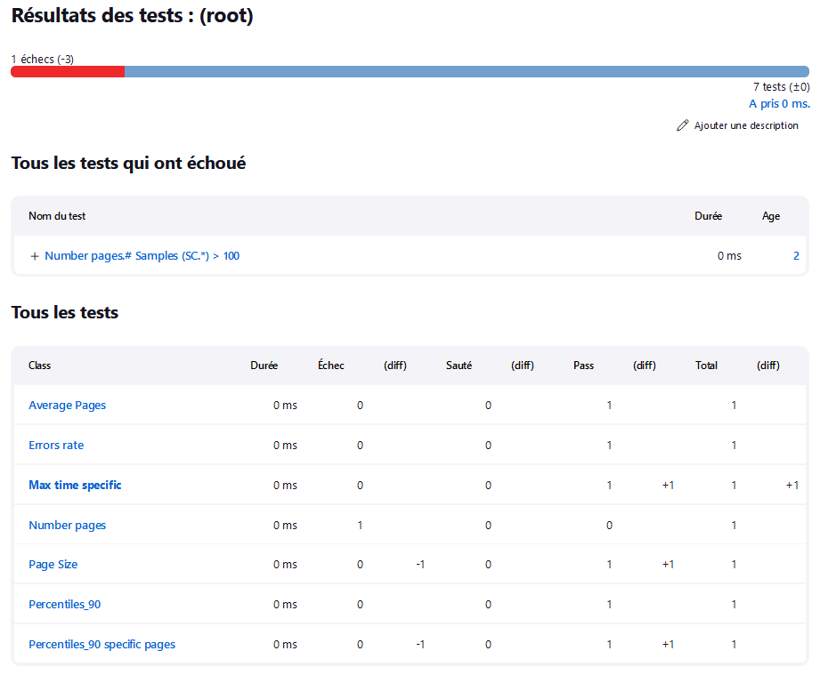

# Generating JUnit Report based on custom Key Performance Indicators (KPIs) applied to the JMeter Report CSV file

This tool read KPI declarations in a file and apply the KPI assertion on a JMeter Report CSV file and generates a result file in JUnit XML format.

JMeter Report CSV file is created with Listener : 
- Summary Report, documentation at [Summary Report](https://jmeter.apache.org/usermanual/component_reference.html#Summary_Report)
- Aggregate Report, documentation at [Aggregate Report](https://jmeter.apache.org/usermanual/component_reference.html#Aggregate_Report)
- Synthesis Report, documentation at [Synthesis Report](https://jmeter-plugins.org/wiki/SynthesisReport/)

and "Save Table Data" button<br>


JMeter Report CSV could be generated in Command Line Interface (CLI) with :
- JMeterPluginsCMD tool, documentation at [JMeterPluginsCMD](https://jmeter-plugins.org/wiki/JMeterPluginsCMD/)
  - E.g : JMeterPluginsCMD.bat --generate-csv aggregate.csv --input-jtl results.csv --plugin-type AggregateReport
  - JMeterPluginsCMD.bat --generate-csv synthesis.csv --input-jtl results.csv --plugin-type SynthesisReport
- jmeter-graph-tool-maven-plugin maven plugin, documentation at [jmeter-graph-tool-maven-plugin](https://github.com/vdaburon/jmeter-graph-tool-maven-plugin)

Example of a JMeter Report CSV file (Synthesis Report)<br>


The first line contains **header** column name<br>


## The KPI file format
The KPI file need 5 columns :
1) name_kpi the name of the KPI also the classname in the Test Case in JUnit
2) metric_csv_column_name the column name **header** in the JMeter Report CSV file (**header** likes : `# Samples` or `Average` or `Min` or `Max` or `90% Line` or `Std. Dev.` or `Error %` or `Throughput` or `Received KB/sec` or `Avg. Bytes` or `MY_COLUMN_NAME`)
3) label_regex the Label name in regular expression, label header in the JMeter Report CSV file (E.g : `SC01_P.*` or `SC\d+_P.*` or `SC01_P01_LOGIN` or `SC01_P01_LOGIN|SC01_P02_HOME` or `\d+ /.*` )
4) comparator the comparator `<` or `<=` or `>` or `>=`
5) threshold the value (for percentage rate use value between 0 and 1, e.g : 0.02 for 2%)

The column separator is ',' for the kpi file
<pre>
name_kpi,metric_csv_column_name,label_regex,comparator,threshold
Percentiles_90,90% Line,SC\d+_P.*,<=,3000
Percentiles_90 specific pages,90% Line,SC01_P01_LOGIN|SC01_P02_HOME,<=,4000
Average Pages,Average,SC\d+_P.*,<=,2000
Errors rate,Error %,SC\d+_SCRIPT.*,<,0.01
Page Size,Avg. Bytes,SC.*,<=,512000
Max time specific API,Max,"010 /api/user/.+",<=,5000
Number pages,# Samples,SC.*,>,10
</pre>

KPI View in Excel<br>


Save in UTF-8 comma separator **no BOM** or csv with comma separator if you have only ASCII characters (no accent é,è, à ...)

## Parameters 
The tool have parameters :
<pre>
usage: io.github.vdaburon.jmeter.utils.reportkpi.JUnitReportFromJMReportCsv -csvJMReport &lt;csvJMReport&gt; [-csvLabelColumnName &lt;csvLabelColumnName&gt;]
       [-exitReturnOnFail &lt;exitReturnOnFail&gt;] [-help] [-junitFile &lt;junitFile&gt;] -kpiFile &lt;kpiFile&gt;
io.github.vdaburon.jmeter.utils.reportkpi.JUnitReportFromJMReportCsv
 -csvJMReport &lt;csvJMReport&gt;                 JMeter report csv file (E.g : summary.csv)
 -csvLabelColumnName &lt;csvLabelColumnName&gt;   Label Column Name in CSV JMeter Report (Default : Label)
 -exitReturnOnFail &lt;exitReturnOnFail&gt;       if true then when kpi fail then create JUnit XML file and program return exit 1 (KO); if false
                                            [Default] then create JUnit XML File and exit 0 (OK)
 -help                                      Help and show parameters
 -junitFile &lt;junitFile&gt;                     junit file name out (Default : jmeter-junit-plugin-jmreport.xml)
 -kpiFile &lt;kpiFile&gt;                         KPI file contains rule to check (E.g : kpi.csv)
E.g : java -jar junit-reporter-kpi-from-jmeter-report-csv-&lt;version&gt;-jar-with-dependencies.jar -csvJMReport summary.csv  -kpiFile kpi.csv -exitReturnOnFail true
or more parameters : java -jar junit-reporter-kpi-from-jmeter-report-csv-&lt;version&gt;-jar-with-dependencies.jar -csvJMReport AggregateReport.csv  -csvLabelColumnName Label 
-kpiFile kpi_check.csv -junitFile junit.xml -exitReturnOnFail true
</pre>

## JUnit Report XML file generated
Example JUnit XML file generated :
```xml
<?xml version="1.0" encoding="UTF-8" standalone="no"?>
<testsuite errors="0" failures="2" name="JUnit Report From JMeter Report Csv" skipped="0" tests="3">
    <testcase classname="Percentiles_90" name="90% Line (SC\d+_P.*) &lt;= 30">
        <failure message="">Actual value 63.0 exceeds or equals threshold 30.0 for samples matching "SC\d+_P.*"; fail label(s) "SC01_P01_HOME", "SC03_P01_HOME", "SC03_P03_LOGIN", "SC01_P03_LOGIN", "SC03_P04_LINK_STATS", "SC01_P05_LAUNCH_FIND"</failure>
    </testcase>
    <testcase classname="Average Page One Page" name="Average (SC01_P05_LAUNCH_RECH) &lt;= 60">
        <failure message="">Actual value 79.0 exceeds or equals threshold 60.0 for samples matching "SC01_P05_LAUNCH_FIND"; fail label(s) "SC01_P05_LAUNCH_FIND"</failure>
    </testcase>
    <testcase classname="Error rate" name="Error % (SC.*) &lt; 0.02"/>
</testsuite>
```
Remark : failure message is limited to 1024 characters, if failure message finished with "..." then the message is voluntarily truncated.

## JUnit Report in a Gitlab Pipeline
A JUnit Report with KPIs display in a Gitlab Pipeline<br>


If you click on button "View Details" for Status Fail, you will show the fail message<br>


## JUnit Report in Jenkins Build
A JUnit Report with KPIs display in Jenkins Build<br>


If you click on link "Name Test" fail , you will show the fail message<br>


## License
See the LICENSE file Apache 2 [https://www.apache.org/licenses/LICENSE-2.0](https://www.apache.org/licenses/LICENSE-2.0)

## Usage Maven
The maven groupId, artifactId and version, this plugin is in the **Maven Central Repository** [](https://maven-badges.herokuapp.com/maven-central/io.github.vdaburon/junit-reporter-kpi-from-jmeter-report-csv)

```xml
<groupId>io.github.vdaburon</groupId>
<artifactId>junit-reporter-kpi-from-jmeter-report-csv</artifactId>
<version>1.1</version>
```
Just include the plugin in your `pom.xml` and execute `mvn verify` <br>
or individual launch `mvn -DjmeterReportFile=synthesis.csv -DkpiFile=kpi.csv -DjunitFile=jmeter-junit-plugin-jmreport.xml exec:java@junit-reporter-kpi-from-jmeter-report-csv`

```xml

<project>
  <properties>
    <jmeterReportFile>synthesis.csv</jmeterReportFile>
    <kpiFile>kpi.csv</kpiFile>
    <junitFile>jmeter-junit-plugin-jmreport.xml</junitFile>
  </properties>

  <dependencies>
    <dependency>
      <groupId>io.github.vdaburon</groupId>
      <artifactId>junit-reporter-kpi-from-jmeter-report-csv</artifactId>
      <version>1.2</version>
    </dependency>
  </dependencies>

  <build>
    <plugins>
      <plugin>
        <groupId>org.codehaus.mojo</groupId>
        <artifactId>exec-maven-plugin</artifactId>
        <version>1.2.1</version>
        <executions>
          <execution>
            <id>create_junit-report-kpi-from-jmeter-report</id>
            <phase>verify</phase>
            <goals>
              <goal>java</goal>
            </goals>
            <configuration>
              <mainClass>io.github.vdaburon.jmeter.utils.reportkpi.JUnitReportFromJMReportCsv</mainClass>
              <arguments>
                <argument>-kpiFile</argument>
                <argument>${project.build.directory}/jmeter/testFiles/${kpiFile}</argument>
                <argument>-csvJMReport</argument>
                <argument>${project.build.directory}/jmeter/results/${jmeterReportFile}</argument>
                <argument>-junitFile</argument>
                <argument>${project.build.directory}/jmeter/results/${junitFile}</argument>
                <argument>-exitReturnOnFail</argument>
                <argument>true</argument>
              </arguments>
            </configuration>
          </execution>
        </executions>
      </plugin>
    </plugins>
  </build>
</project>
```

## Simple jar tool
This tool is a java jar, so it's could be use as simple jar (look at [Release](https://github.com/vdaburon/JUnitReportKpiJMeterReportCsv/releases) to download jar file)
<pre>
java -jar junit-reporter-kpi-from-jmeter-report-csv-&lt;version&gt;-jar-with-dependencies.jar -csvJMReport summary.csv -kpiFile kpi.csv -junitFile junit-report.xml -exitReturnOnFail true
</pre>

## Link to other project
Usually this plugin is use with [jmeter-graph-tool-maven-plugin](https://github.com/vdaburon/jmeter-graph-tool-maven-plugin)

## Versions
Version 1.2 change package name (add reportkpi)

Version 1.1 change groupId

Version 1.0 initial version

